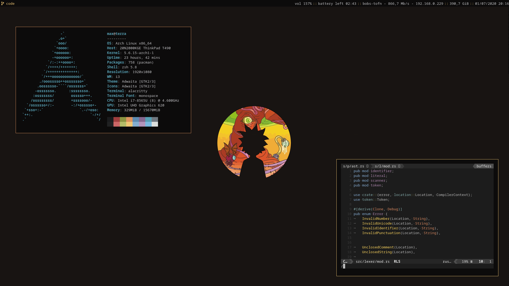
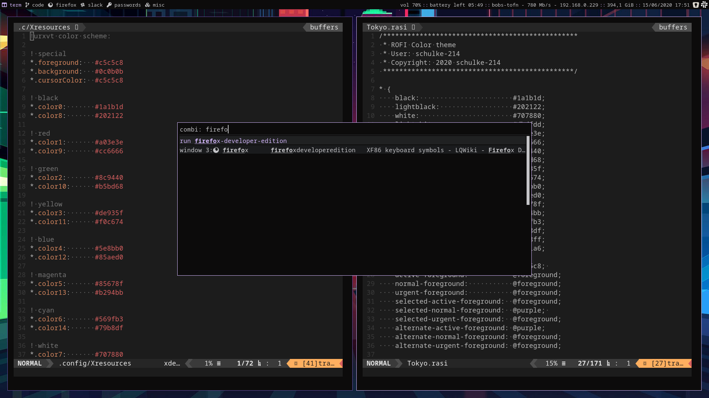

# Dotfiles




```zsh
guide -> https://harfangk.github.io/2016/09/18/manage-dotfiles-with-a-git-bare-repository.html

git clone --bare git@github.com:schulke-214/dotfiles.git ~/.dotfiles
alias dotfiles="/usr/bin/git --git-dir=$HOME/.dotfiles.git/ --work-tree=$HOME"
git clone https://github.com/ohmyzsh/ohmyzsh.git ~/.oh-my-zsh
git clone https://github.com/lukechilds/zsh-nvm ~/.oh-my-zsh/custom/plugins/zsh-nvm
```

### Todo
Init screenlayouts depending on which monitor is connected
